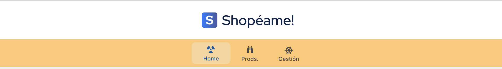
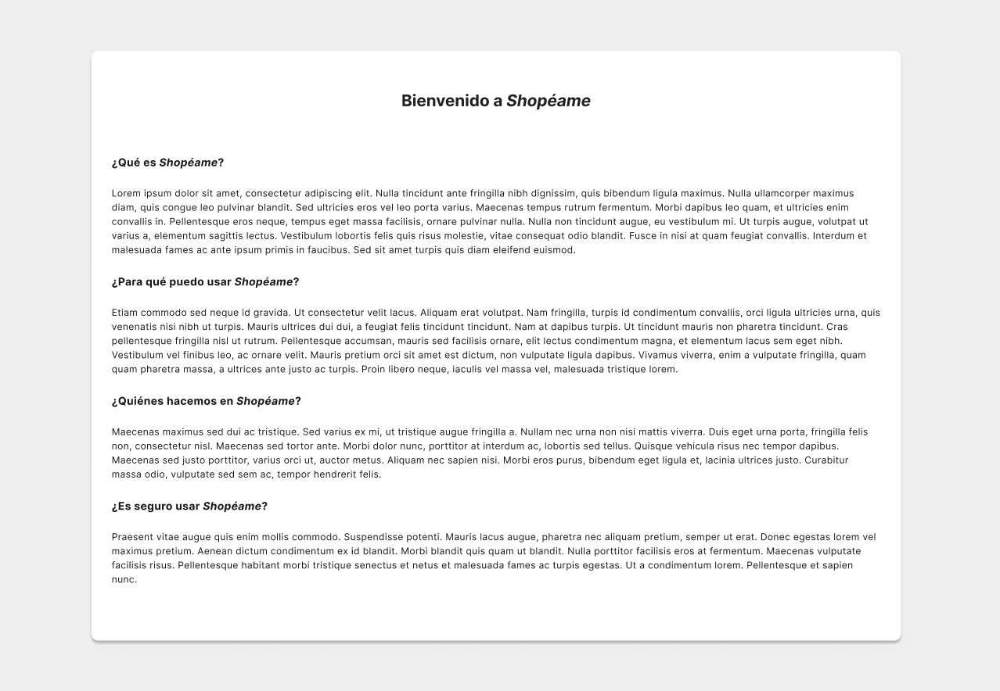
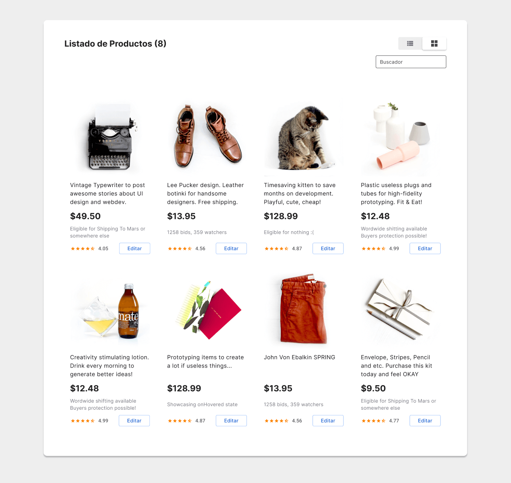
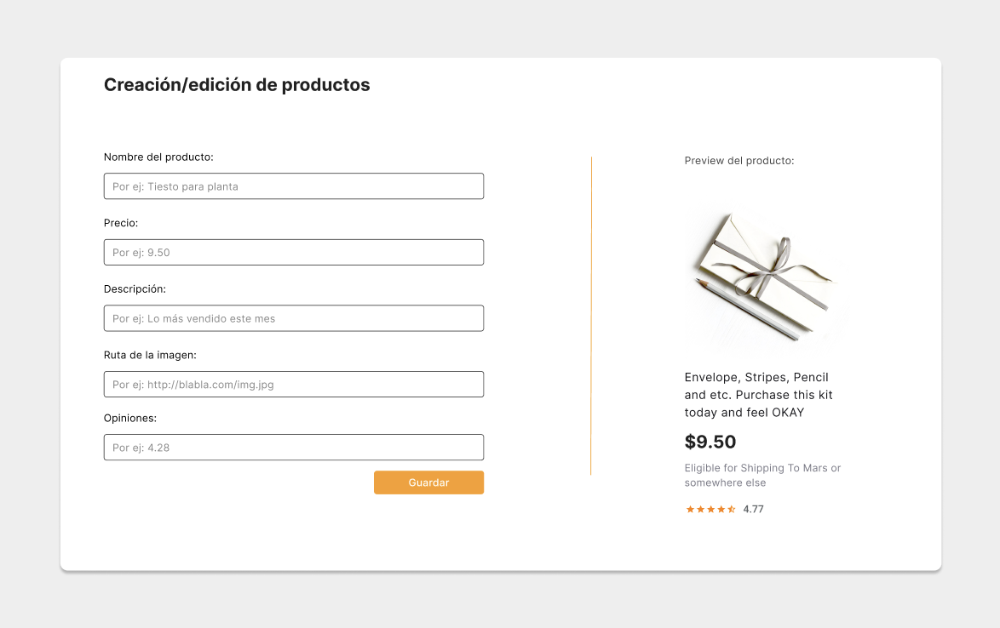
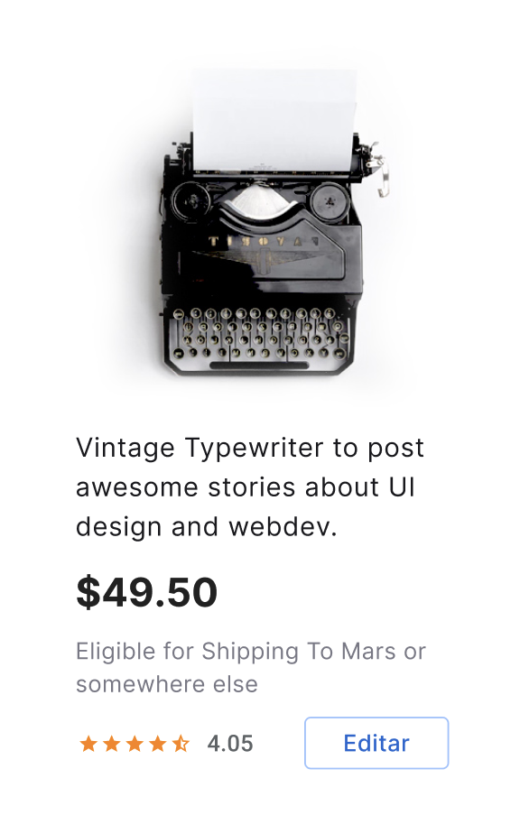

# Angular S9: Proyecto

Ha llegado el día en el que desarrollaremos nuestra primera aplicación angular completa, para ello aplicaremos todos los conocimientos adquiridos a lo largo de las sesiones anteriores.

La aplicación debéis desarrollarla de forma individual, es decir que cada alumno debe subir una PR a su nombre con la solución, pero lógicamente podéis ayudaros entre vosotros :)

El proyecto realizado debe ajustarse al siguiente diseño:

[https://www.figma.com/file/6ZheZRH5UiHMC6tw9F4kQl/Shopéame](https://www.figma.com/file/6ZheZRH5UiHMC6tw9F4kQl/Shop%C3%A9ame)

Si te registras en Figma además de ver los diseños podrás consultar los tamaños, colores, tipografía... muy recomendado a la hora de maquetar 😉

### Componentes

Debes realizar al menos los siguientes componentes:

1. **Header**
Contendrá el logo de la aplicación y los enlaces del menú principal. Recuerda que debe indicar en qué página te encuentras en cada momento

2. **Footer**
Como habrás observado es un componente bastante sencillo, en principio solo contendrá unos enlaces a redes sociales. Para el aviso de Copyright te aconsejamos que no pongas el año en el template "a fuego", para que cuando llegue 2021 cambie automáticamente.

3. **Página de Inicio**
Será un componente que muestre un pequeño texto de introducción. Puedes rellenarlo con lorem ipsums como en el diseño:

4. **Página de Productos**
Debe mostrar la lista de productos disponibles, como observarás es uno de los componentes principales de la aplicación. Tendrá un pequeño buscador que filtre los productos por su nombre. 

El listado de productos se obtendrá desde la siguiente API mediante un GET:
[https://my-json-server.typicode.com/franlindebl/shopeame-api-v2/products](https://my-json-server.typicode.com/franlindebl/shopeame-api-v2/products)

Opcionalmente puedes añadir los botones de cambio de vista entre cuadrícula y listado.

5. **Página de Gestión**
Desde esta página el usuario podrá crear nuevos productos mediante un formulario. Durante la creación podrás ver una pequeña preview del producto a la derecha del formulario. Estos productos se guardarán en el servicio, de manera que cuando se le pidan los produtos, este devolverá el listado de la API + los que tenga almacenados.

Recuerda que el formulario deberá tener validadores para comprobar los campos

Opcionalmente podrás usar esta página para editar productos ya existentes, ya que la API permite modificaciones mediante PUT.
****

6. **Componente producto**
A la hora de mostrar los productos te será mucho más cómodo crear un componente para ello. Deberá mostrar el producto tal que así:

### Requisitos generales

En nuestra aplicación deberemos tener los siguientes requisitos técnicos:

1. Tipado: debes hacer uso de intefaces para tipar los elementos de nuestra aplicación. Está prohibido el uso de tipo object o any.
2. Distribución de la aplicación en módulos. La aplicación deberá contar con al menos dos módulos, tal y como os hemos indicado con anterioridad uno será el shared.module, lo correcto es que uses además de este, un módulo por página también.
3. Formularios reactivos: Deberás hacer uso de los formularios reactivos y sus validaciones con mensajes de error
4. Router: Deberás hacer uso del router y aplicar carga dinámica de módulos a través del lazy loading.
5. Uso de un pipes, por ejemplo para el componente de filtrado o para mostrar los nombres
6. Testing: Integra test unitarios en al menos un componente, aunque es deseable que testeees todos.

Realmente os parecerá un mundo pero como en vuestro día a día como programadores no estaréis solos, os ayudaremos a definir la arquitectura de vuestra aplicación y asegurarnos de que no tengáis bloqueos.

¡Este es el momento de demostrar que sois unos verdaderos Upgraders!